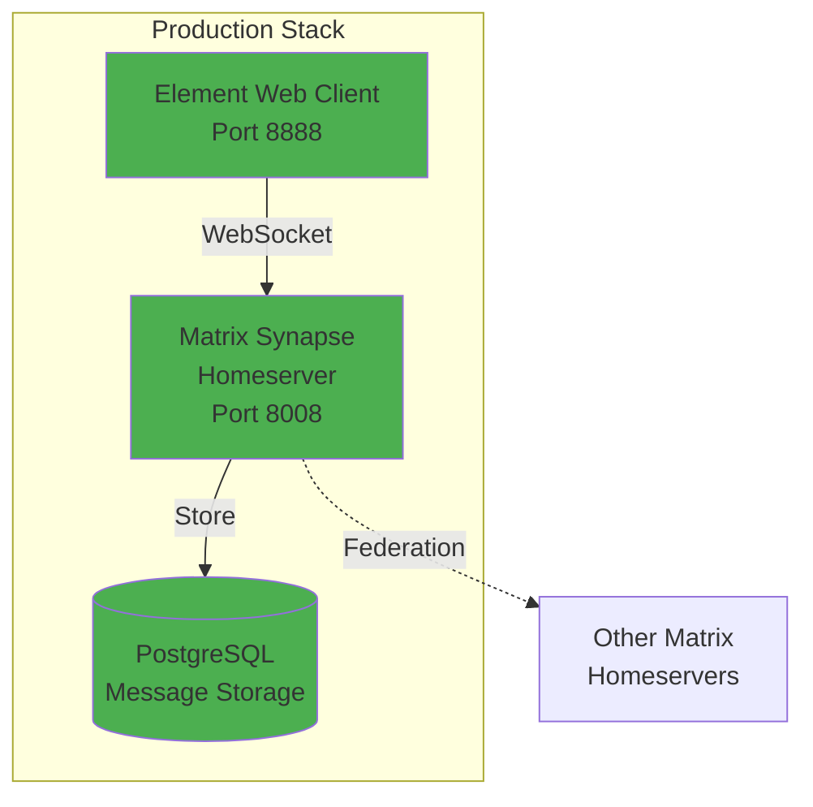
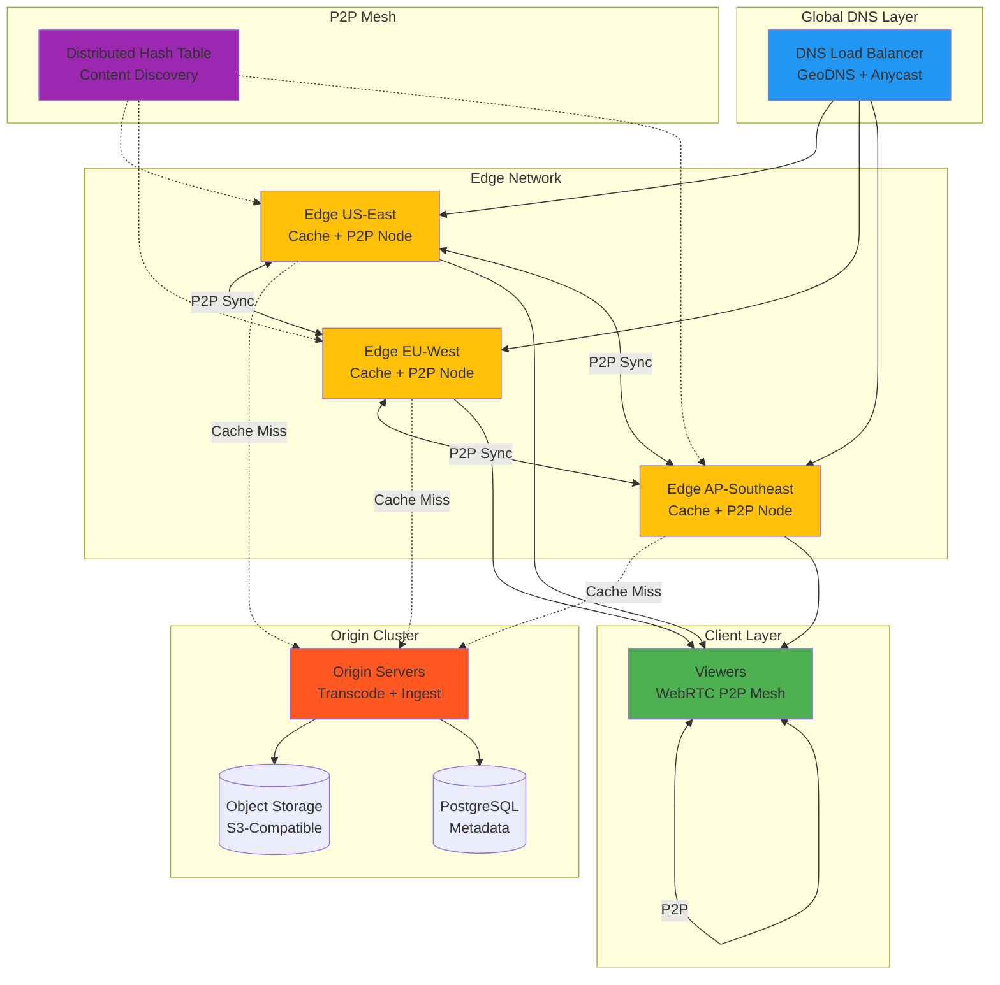
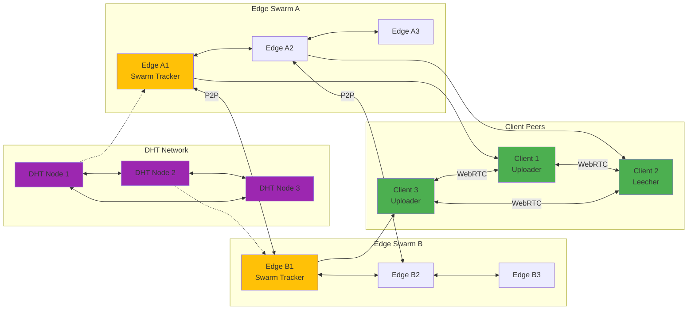

# AMI Streams Module

**Real-Time Messaging & Future Streaming Infrastructure**

The Streams module currently provides production-ready Matrix homeserver for federated real-time messaging. The module is designed as the foundation for future distributed CDN, P2P content delivery, and media streaming capabilities.

## Current Implementation Status

### ✅ Production Ready

**Matrix Homeserver (Operational)**
- **Production Synapse Deployment**: Federated Matrix homeserver with Element web client
- **End-to-End Encryption**: Double Ratchet algorithm for secure messaging
- **WebSocket Event Streaming**: Real-time message delivery and presence updates
- **Federation Support**: Connect to global Matrix network or run isolated
- **Complete Configuration**: See `config/matrix/` for homeserver.yaml and Element config

### 🚧 Planned Development

The following capabilities are architectural specifications for future development:

**Distributed CDN Infrastructure**
- Multi-region edge network with intelligent caching
- Geographic load balancing and DDoS protection
- Edge-to-edge content replication
- Content purge and invalidation across nodes

**Peer-to-Peer Distribution**
- DHT-based content discovery (Kademlia routing)
- BitTorrent-style swarming for popular content
- WebRTC mesh networking for client-assisted delivery
- Raft consensus for edge coordination
- Content-addressed storage (IPFS-style)
- Edge-to-edge P2P without origin bottleneck

**Media Streaming**
- RTMP ingest for live streaming
- HLS/DASH adaptive bitrate output
- WebRTC for ultra-low latency
- Hardware-accelerated transcoding (NVENC, QSV, AMF)
- VOD pipeline with multi-format support

**Edge Computing**
- Serverless functions at edge nodes
- JavaScript/WASM/Python execution in V8 isolates
- Request/response transformation
- Edge authentication and A/B testing

**Remote Desktop Streaming**
- RDP server and web client
- Virtual display management
- Display capture and streaming pipeline

**OBS Studio Integration**
- WebSocket API control for automation
- Scene management and source control
- Multi-destination streaming

---

## Architecture Vision

### Current Architecture: Matrix Messaging



### Future Architecture: Distributed CDN + P2P



**Architecture Goals:**
- **No Single Point of Failure**: DHT and P2P eliminate origin bottleneck
- **Self-Healing Network**: Automatic peer discovery and mesh reformation
- **Linear Scalability**: Each peer/edge adds capacity
- **Cost Efficiency**: 60-90% origin bandwidth reduction via P2P
- **Global Performance**: <50ms latency via edge caching and P2P

### Future P2P Mesh Topology



---

## Quick Start: Matrix Homeserver

### Launch Matrix Stack

```bash
# Start Matrix Synapse homeserver + Element web client
docker-compose -f ../../docker-compose.services.yml --profile matrix up -d

# Access Element web client
# Navigate to: http://localhost:8888

# Create admin user (run from host or inside container)
docker exec -it ami-matrix-synapse register_new_matrix_user \
  -u admin -p <password> -a http://localhost:8008
```

### Matrix Configuration

Complete setup documentation available at:
- **Setup Guide**: `config/matrix/README.md`
- **Integration Guide**: `config/matrix/INTEGRATION.md`
- **Homeserver Config**: `config/matrix/homeserver.yaml`
- **Element Config**: `config/matrix/element-config.json`

### Matrix Features

- **Federated Messaging**: Connect to global Matrix network or run isolated
- **End-to-End Encryption**: E2EE for private rooms using Olm/Megolm
- **Room Types**: Public channels, private rooms, direct messages
- **File Sharing**: Upload images, videos, documents to rooms
- **Bridges**: Connect to Slack, Discord, Telegram, IRC (requires bridge setup)
- **Bot Integration**: Matrix bot SDK for automation and integrations
- **Voice/Video Calls**: WebRTC-based 1:1 and group calls via Jitsi

---

## Module Structure

```
streams/
├── backend/
│   ├── base/              # Placeholder base package
│   ├── matrix/            # Matrix integration (minimal)
│   └── rdp/               # RDP placeholders
│       └── windows/
│           └── vdd/       # Virtual display driver stubs
├── config/
│   └── matrix/            # Production Matrix configuration
│       ├── README.md
│       ├── INTEGRATION.md
│       ├── homeserver.yaml
│       └── element-config.json
├── scripts/
│   └── run_tests.py       # Test runner
└── tests/
    └── test_basic.py      # Basic smoke tests
```

**Note**: Directories for CDN, P2P, streaming, edge functions, and OBS do not exist yet. These are architectural specifications for future implementation.

---

## Development Roadmap

### Phase 1: Core Streaming Infrastructure (Q1 2026)
- [ ] RTMP ingest server
- [ ] FFmpeg transcoding pipeline
- [ ] HLS/DASH output packager
- [ ] Object storage integration (S3-compatible)
- [ ] Basic CDN edge node with caching

### Phase 2: Edge Distribution (Q2 2026)
- [ ] Edge-to-origin replication
- [ ] Geographic load balancing
- [ ] Cache invalidation protocol
- [ ] Edge health monitoring
- [ ] Auto-scaling edge deployment

### Phase 3: P2P Distribution (Q3 2026)
- [ ] DHT implementation (Kademlia)
- [ ] BitTorrent-style swarm tracker
- [ ] WebRTC mesh networking
- [ ] P2P client library (JavaScript)
- [ ] Edge-to-edge P2P synchronization

### Phase 4: Advanced Features (Q4 2026)
- [ ] Raft consensus for edge coordination
- [ ] Content-addressed storage (IPFS-style)
- [ ] Edge serverless functions (V8 isolates)
- [ ] Blockchain-based content registry
- [ ] Peer reputation and trust system

### Phase 5: Remote Desktop & OBS (Q1 2027)
- [ ] RDP server implementation
- [ ] Virtual display management
- [ ] OBS WebSocket integration
- [ ] Display capture pipeline

---

## Technical Specifications (Future)

### Planned CDN Performance Targets
- **Edge Latency**: <50ms P99 globally for cached content
- **Cache Hit Ratio**: >95% for hot content
- **Origin Offload**: 90%+ of traffic served from edge
- **Throughput**: 10 Gbps per edge node
- **Concurrent Connections**: 100K+ per edge node

### Planned P2P Performance Targets
- **Origin Offload**: 60-90% for popular content via P2P
- **Peer Discovery**: <500ms via DHT lookup
- **Mesh Formation**: <2 seconds for 20-peer mesh
- **DHT Routing**: O(log N) lookups
- **Consensus Latency**: <100ms for Raft election

### Planned Streaming Performance Targets
- **Encoding Latency**: <50ms (hardware accelerated)
- **HLS Latency**: 6-12 seconds
- **DASH Latency**: 4-8 seconds
- **WebRTC Latency**: <500ms
- **Video Quality**: 240p to 4K60 with HDR

---

## Integration with AMI Modules

### Files Module (Future)
- Object storage backend for media files
- CDN integration for file delivery
- Chunked upload pipeline

### Browser Module (Future)
- Stream playback testing automation
- WebRTC call testing
- Screenshot capture for thumbnails

### Nodes Module (Future)
- Remote desktop streaming via RDP
- Distributed transcoding across node fleet
- Edge node deployment automation

### DataOps - Base Module (Current)
- Postgres for Matrix message storage
- Redis for session caching (if configured)
- Prometheus metrics (if configured)

---

## Security Considerations

**Current (Matrix)**
- TLS 1.2+ for client connections
- End-to-end encryption for private rooms
- Federation over HTTPS

**Future**
- TLS 1.3 everywhere
- DRM integration (FairPlay, Widevine, PlayReady)
- Signed URLs for private content
- JWT authentication for API access
- Rate limiting and DDoS mitigation
- Peer reputation and content verification

---

## Testing

### Run Tests

```bash
# Run module test suite
./scripts/ami-run.sh streams/scripts/run_tests.py

# Currently: 1 basic smoke test
# Future: Comprehensive integration tests for streaming, P2P, edge
```

---

## Current Implementation Notes

**What Exists:**
- Production Matrix homeserver configuration
- Docker Compose integration
- Element web client configuration
- Basic module structure and tests

**What Doesn't Exist:**
- CDN edge nodes
- P2P network implementation
- Streaming servers (RTMP, HLS, DASH)
- Transcoding pipeline
- Edge computing platform
- RDP server
- OBS integration
- DHT, swarm, or mesh networking code

**Documentation Status:**
- `README.md`: Clearly separates current vs. planned features
- `REQUIREMENTS.md`: Technical specifications for planned features
- `config/matrix/`: Production Matrix documentation

---

## License

MIT License - Copyright © 2025 Independent AI Labs
